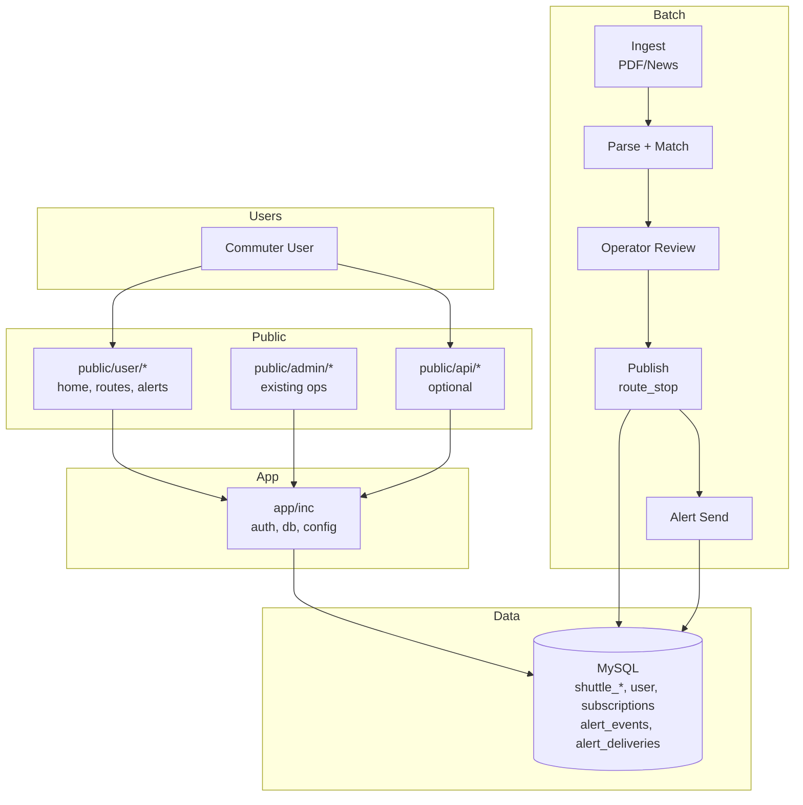

# Architecture — v1.4 System (MVP2)

**상태:** 계획 전용. 구현은 다음 단계에서 진행.

---

## System architecture (high-level)

---

## Components

| Component | 설명 |
|-----------|------|
| **public/user/** | 사용자 페이지: home, routes, alerts. 노선 검색·정류장 조회·구독·공지 피드. |
| **public/admin/** | 기존 관리자 페이지. doc, route_review, review_queue, ops_dashboard, alias_audit 등. 변경 없음. |
| **public/api/** | (선택) REST/JSON API. v1.4에서 필요 시 추가. |
| **app/inc/** | 공통: auth, db, config. user 쪽 인증/세션 정책은 v1.4 설계 시 확정(확인 필요). |
| **Batch / automation** | PDF·뉴스 수집 → 파싱·매칭 → 운영자 검수 → 승격(publish) → 알림 발송. 기존 run_job/parse_match/promote 플로우 유지. |
| **DB** | 기존 shuttle_* 테이블 + v1.4 신규: user, subscriptions, alert_events, alert_deliveries 등(ERD draft 참고). |

---

## Automation pipeline

1. **Ingest** — PDF/뉴스 수집(수동 업로드 또는 배치). 확인 필요: 자동 수집 스크립트 도입 여부.
2. **Parse** — 기존 PARSE_MATCH job. 후보(candidates) 생성.
3. **Operator review** — route_review에서 approve/reject, alias 등록. SoT·게이트 유지.
4. **Publish** — promote로 route_stop 스냅샷 반영. latest PARSE_MATCH만.
5. **Alert send** — 공지/이벤트 발생 시 구독자에게 발송(이메일 또는 인앱). alert_events + alert_deliveries 기록.

---

## Failure modes + recovery (brief)

- **DB/쿼리 실패:** ERROR_POLICY 준수. 사용자에는 muted 안내, 로그에 메시지·컨텍스트 기록. 재시도는 배치에서만(알림 재발송 등).
- **파싱/매칭 실패:** 기존과 동일. job 실패 시 재실행. SoT 훼손 없음.
- **알림 발송 실패:** alert_deliveries에 실패 상태 저장, 재시도 큐 또는 수동 재발송(확인 필요).
- **세션/인증 오류:** SECURITY_BASELINE·ERROR_POLICY. 비인증 시 로그인 페이지로 리다이렉트.

---

*문서 버전: v1.4-00 (planning-only).*
