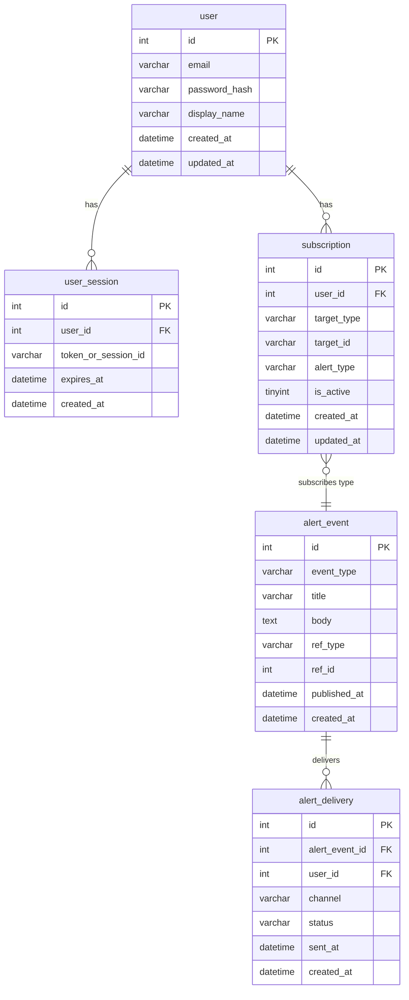

# ERD Draft — v1.4 New Tables Only

**상태:** 계획 전용. DDL 실행은 PC(Workbench)에서만. 아래 스키마는 **확인 필요** — 구현 시 검토·수정 후 적용.

기존 테이블(shuttle_doc_job_log, shuttle_stop_candidate, shuttle_stop_alias, route_stop, seoul_bus_stop_master 등)은 변경하지 않음.

---

## Mermaid ERD (new tables only)

---

## Table summaries (high-level)

| Table | Purpose | Key columns |
|-------|---------|-------------|
| user | 사용자 계정 | id, email, password_hash, display_name, created_at, updated_at |
| user_session | 세션 또는 토큰(재사용 여부 확인 필요) | id, user_id, token_or_session_id, expires_at |
| subscription | 구독 설정(노선/정류장/이벤트 유형별) | id, user_id, target_type, target_id, alert_type, is_active |
| alert_event | 공지/이벤트 원본(공휴, 사고, 이벤트 등) | id, event_type, title, body, ref_type, ref_id, published_at |
| alert_delivery | 발송 이력(누구에게, 어떤 채널, 성공/실패) | id, alert_event_id, user_id, channel, status, sent_at |

---

## DDL

- **확인 필요:** 위 구조는 초안. 인덱스(user_id, expires_at, alert_event_id 등), UNIQUE, NOT NULL, charset 등은 구현 단계에서 확정 후 PC에서만 DDL 실행.

---

*문서 버전: v1.4-00 (planning-only).*
