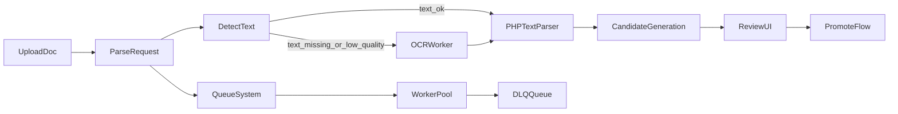

# PDF Pipeline Future Design (OCR + Worker)

## 목적
- 현재 PHP 동기 파싱(텍스트 PDF)을 유지하면서,
- 2차에서 비동기 워커 구조로 무중단 확장하기 위한 설계 기준을 정의한다.
- **OCR fallback은 v1.7-20에서 이미 구현됨** (run_ocr_extract + extract_text.py)

## 현재(1차) 상태 — OCR 구현 완료

- 실행 경로: `public/admin/run_job.php`
- 파서: `app/inc/parse/pdf_parser.php`
- OCR: `app/inc/parse/pdf_parser.php::run_ocr_extract()` → `scripts/python/extract_text.py` (exec)
- 배치 재처리: `scripts/php/run_parse_match_batch.php`
- 상태: `shuttle_source_doc.parse_status` (`pending/running/success/failed`)

```mermaid
flowchart LR
  uploadDoc[UploadDoc] --> parseRequest[ParseRequest]
  parseRequest --> phpParser[PHPTextParser]
  phpParser --> smalot[smalot getText]
  smalot -->|텍스트 있음| extractRoute[route_label + stops 추출]
  smalot -->|텍스트 없음| runOcr[run_ocr_extract]
  runOcr -->|exec| extractText[extract_text.py]
  extractText -->|Tesseract kor+eng| extractedText[추출 텍스트]
  extractedText --> extractRoute
  extractRoute --> candidateGen[CandidateGeneration]
  candidateGen --> reviewUi[ReviewUI]
  reviewUi --> promoteFlow[PromoteFlow]
```



## OCR 현재 구현 (v1.7-20)

### 스캔 PDF 판별·fallback 흐름
1. `parse_shuttle_pdf()` → smalot/pdfparser `getText()` 시도
2. `getText()` 결과가 비어 있으면 → `run_ocr_extract($filePath)` 호출
3. `run_ocr_extract()`가 `extract_text.py`를 exec로 실행
4. 추출 성공 시 `warning_codes`에 `ocr_used` 추가, 동일 파싱 로직 진행
5. 실패 시 `error_code=OCR_FAILED` 반환

### OCR 입력/출력 계약
- **run_ocr_extract(string $pdfPath): ?string**
  - 입력: PDF 절대 경로
  - 출력: 추출된 텍스트 or null (실패 시)
  - 실행: `python extract_text.py --input-file <path> --output <tmp> --output-format text_only --lang kor+eng [--tesseract-cmd ...]`

- **extract_text.py CLI**
  - `--input-file`: 단일 PDF 경로
  - `--output`: 출력 txt 경로
  - `--output-format text_only`: gilime용 raw 텍스트만
  - `--tesseract-cmd`: Tesseract 실행 경로 (Windows)

### 설정
- `config.local.php`: `OCR_PYTHON_CMD`, `OCR_TESSERACT_CMD`
- 운영 가이드: `docs/operations/PDF_OCR_SETUP_v1_7.md`

### 향후 개선 (2차 설계)
- 타임아웃: exec 무한 대기 방지
- 재시도: OCR 일시 실패 시 재시도 로직
- 관리형 OCR: 클라우드 OCR 엔진 검토

## OCR 분기 조건 (2차 확장)
- **품질 점수**: 추출된 텍스트가 정류장/노선 패턴과 매칭되지 않을 때 (예: 유의미한 한글 토큰 < N개) → `LOW_QUALITY` 신규 코드

## 2차 아키텍처 목표
1. 스캔 PDF 자동 분기(OCR)
2. 대량 처리 시 비동기/재시도/격리(DLQ)
3. 실패 원인 코드 표준화 및 운영 관측 강화

## 제안 아키텍처



## 상태머신(권장)
- `pending` -> `queued` -> `running` -> `success`
- 실패 시:
  - 재시도 가능: `retry_wait`
  - 재시도 초과: `failed` + DLQ 이벤트

## 오류코드 표준(초안)
- 입력/파일:
  - `FILE_NOT_FOUND`
  - `INVALID_FILE_TYPE`
  - `FILE_TOO_LARGE`
- 파싱:
  - `NO_TEXT`
  - `ROUTE_NOT_FOUND`
  - `STOPS_NOT_FOUND`
  - `PARSE_EXCEPTION`
- OCR:
  - `OCR_FAILED` (현재 구현: run_ocr_extract 실패 시)
  - `OCR_TIMEOUT` (향후)
  - `OCR_ENGINE_ERROR` (향후)
  - `OCR_TEXT_EMPTY` (향후)
- 워커/큐:
  - `QUEUE_PUBLISH_FAILED`
  - `WORKER_TIMEOUT`
  - `RETRY_EXHAUSTED`

## 데이터 계약(초안)
### ParseRequest
```json
{
  "source_doc_id": 123,
  "trace_id": "trc_xxx",
  "requested_by": 0,
  "force_ocr": false
}
```

### ParseResult
```json
{
  "source_doc_id": 123,
  "success": true,
  "error_code": null,
  "parser_version": "v1.0.0",
  "duration_ms": 152,
  "route_label": "R1",
  "stops_count": 18
}
```

## 점진 전환 계획 (현재 PHP 동기 → 하이브리드 → 완전 비동기)
1. **Phase A**: 현재 동기 실행 유지 + 큐 발행만 추가(Shadow)
2. **Phase B**: 일부 문서 타입만 워커 처리(Canary)
3. **Phase C**: 기본 경로를 워커로 전환, 동기 실행은 fallback 유지

## 운영 지표(최소)
- 처리량: docs/hour
- 성공률: success / total
- 평균/95p 처리시간
- 오류코드 TopN
- 재시도 횟수 및 DLQ 적재량

## 보안/컴플라이언스
- 업로드 루트 화이트리스트 유지
- 파일 형식/크기 제한 유지
- OCR 원문 저장 시 개인정보(PII) 마스킹 정책 적용
- trace_id로 감사 추적 가능하게 유지

## 2차 착수 체크리스트
- [ ] OCR 엔진 선택(로컬 Tesseract vs Managed OCR)
- [ ] Queue 선택(예: Redis 기반)
- [ ] 워커 배포 전략(Systemd/Windows Service/Container)
- [ ] DLQ 운영 정책 및 알림 채널 확정
- [ ] 비용/성능 기준선 정의(월 처리량, SLA)

