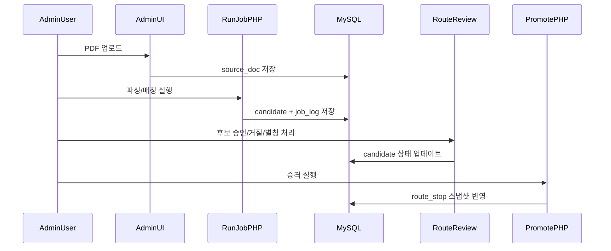
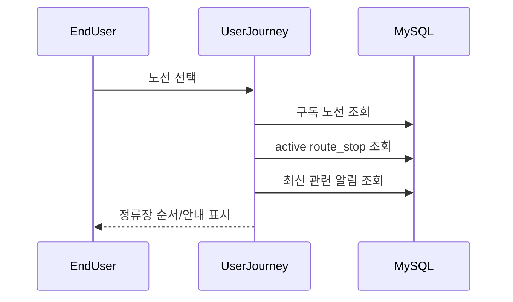
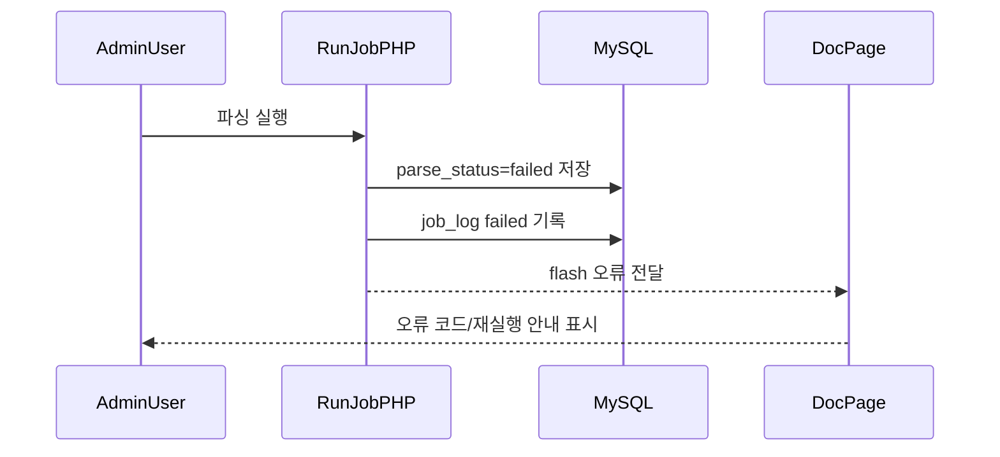
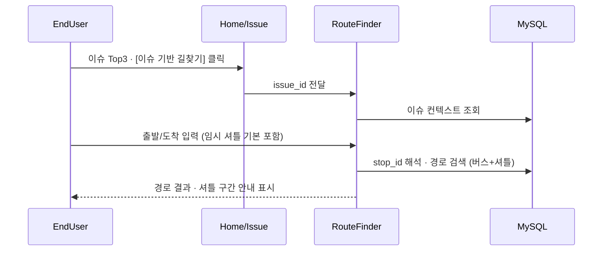

# UML v1.7 MVP

## Sequence 1: 관리자 업로드/파싱/검수/승격

```mermaid
sequenceDiagram
  participant Admin as AdminUser
  participant AdminUI as AdminUI
  participant RunJob as RunJobPHP
  participant DB as MySQL
  participant Review as RouteReview
  participant Promote as PromotePHP

  Admin->>AdminUI: PDF 업로드
  AdminUI->>DB: source_doc 저장
  Admin->>RunJob: 파싱/매칭 실행
  RunJob->>DB: candidate + job_log 저장
  Admin->>Review: 후보 승인/거절/별칭 처리
  Review->>DB: candidate 상태 업데이트
  Admin->>Promote: 승격 실행
  Promote->>DB: route_stop 스냅샷 반영
```

## Sequence 2: 사용자 경로 조회

```mermaid
sequenceDiagram
  participant User as EndUser
  participant UserUI as UserJourney
  participant DB as MySQL

  User->>UserUI: 노선 선택
  UserUI->>DB: 구독 노선 조회
  UserUI->>DB: active route_stop 조회
  UserUI->>DB: 최신 관련 알림 조회
  UserUI-->>User: 정류장 순서/안내 표시
```

## Exception Sequence: 파싱 실패

```mermaid
sequenceDiagram
  participant Admin as AdminUser
  participant RunJob as RunJobPHP
  participant DB as MySQL
  participant Doc as DocPage

  Admin->>RunJob: 파싱 실행
  RunJob->>DB: parse_status=failed 저장
  RunJob->>DB: job_log failed 기록
  RunJob-->>Doc: flash 오류 전달
  Doc-->>Admin: 오류 코드/재실행 안내 표시
```

## Sequence 3: 이슈 기반 길찾기 (v1.8)

```mermaid
sequenceDiagram
  participant User as EndUser
  participant Home as Home/Issue
  participant RF as RouteFinder
  participant DB as MySQL

  User->>Home: 이슈 Top3 · [이슈 기반 길찾기] 클릭
  Home->>RF: issue_id 전달
  RF->>DB: 이슈 컨텍스트 조회
  User->>RF: 출발/도착 입력 (임시 셔틀 기본 포함)
  RF->>DB: stop_id 해석 · 경로 검색 (버스+셔틀)
  RF-->>User: 경로 결과 · 셔틀 구간 안내 표시
```
